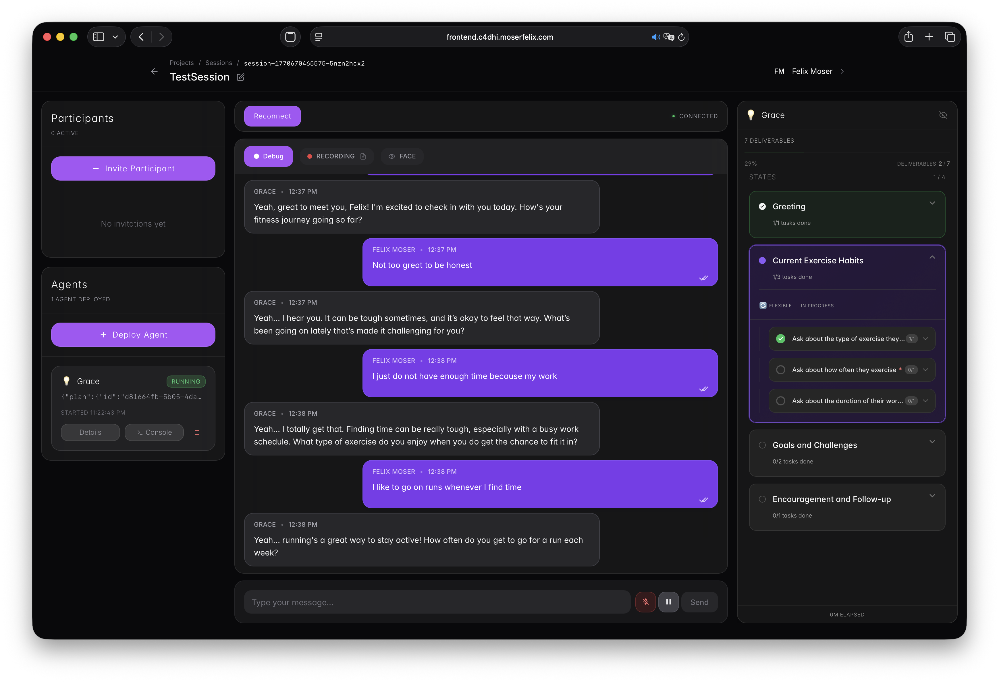

<h1 align="center">STELLA</h1>

<p align="center">
  <strong>System for Testing and Engineering LLM-based Conversational Agents</strong><br>
  Open-source conversational AI infrastructure — focus on your agent, we handle the rest.
</p>

<p align="center">
  <a href="https://github.com/c4dhi/stella/stargazers"></a>
  <a href="https://github.com/c4dhi/stella/blob/main/LICENSE"></a>
  
  <a href="https://c4dhi.github.io/stella/"></a>
  <a href="https://github.com/c4dhi/stella/pulls"></a>
</p>

<p align="center">
  
</p>

---

## 🏠 What is STELLA?

STELLA is an open-source platform for building, deploying, and testing voice-enabled conversational AI agents. Deploy an agent, have a conversation, iterate — it's that simple.

You bring the agent logic. STELLA handles the audio/video streaming, orchestration, and infrastructure. Built with **NestJS**, **React**, a **Python Agent SDK**, **LiveKit** for WebRTC, and **Kubernetes** for on-demand agent orchestration.

## ✨ Key Features

- 🎙️ Voice & text conversations via WebRTC (LiveKit)
- ☸️ On-demand Kubernetes agent orchestration
- 🐍 Python Agent SDK with built-in STT/TTS pipeline
- 🤖 Multi-agent support (stella-v2, stella-light-agent, and custom agents)
- 🛡️ Expert Pool for safe handling of sensitive, high-stakes conversations
- 📋 Plan-driven conversation flows with state machine
- 🔐 Project & session management with role-based access
- 💬 Real-time transcript & event timeline
- 📊 Admin dashboard with live metrics
- 🚀 One-command deployment (`./scripts/start-k8s.sh`)

## ✅ Requirements

To run STELLA you need three things:

- **Docker** — [OrbStack](https://orbstack.dev) (recommended) or [Docker Desktop](https://docker.com/products/docker-desktop) on macOS, Docker Engine on Linux, or Docker via WSL2 on Windows
- **An OpenAI API key** — OpenAI is the default LLM provider (and powers the STT/TTS pipeline). Support for local models via [Ollama](https://ollama.com) and additional providers is on the way
- **A LiveKit server** — [LiveKit Cloud](https://livekit.io/cloud) (easiest) or [self-hosted](https://docs.livekit.io/home/self-hosting/local/), for real-time voice/video

That's it. Kubernetes (OrbStack's built-in cluster or auto-installed K3s), `kubectl`, and PostgreSQL are provisioned automatically by the startup script — you don't install them yourself.

## 🚀 Quick Start

Two commands. That's it.

```bash
git clone https://github.com/c4dhi/stella.git && cd stella
./scripts/start-k8s.sh   # First run launches the setup wizard — no manual .env needed
```

**Frontend** at `http://localhost:5173` · **API** at `http://localhost:3000`

> New here? The [Getting Started](https://c4dhi.github.io/stella/docs/getting-started/prerequisites) guide walks you through everything — prerequisites, LiveKit setup, and deploying your first agent.

## 🏗️ Architecture

```
LiveKit Server (external)  <-->  Agent Pods (Python)
         |                            |
   Frontend UI (React)  <-->  Backend API (NestJS)  <-->  PostgreSQL
         |
   STT/TTS Services (gRPC)
```

Everything runs inside a single **Kubernetes cluster** (OrbStack on macOS, K3s on Linux), deployed automatically by the startup script. Agent pods spin up on-demand per session and clean up after themselves.

## 📖 Documentation

Full docs live at **[c4dhi.github.io/stella](https://c4dhi.github.io/stella/)**.

| | Section | What you'll find |
|---|---------|-----------------|
| 🚀 | [Getting Started](https://c4dhi.github.io/stella/docs/getting-started/prerequisites) | Prerequisites, installation, first agent |
| 🏗️ | [Architecture](https://c4dhi.github.io/stella/docs/architecture/overview) | System design and component deep-dive |
| 🤖 | [Building Agents](https://c4dhi.github.io/stella/docs/building-agents/agent-overview) | Create your own conversational agents |
| 📦 | [Agent SDK Reference](https://c4dhi.github.io/stella/docs/agent-sdk/overview) | Python SDK API reference |
| 🚢 | [Deployment](https://c4dhi.github.io/stella/docs/deployment/overview) | Production deployment guide |
| 🤝 | [Contributing](https://c4dhi.github.io/stella/docs/contributing) | How to get involved |

## 🤝 Contributing

We'd love your help! Whether it's bug reports, feature ideas, docs improvements, or code — all contributions are welcome. Check out the [Contributing Guide](CONTRIBUTING.md) and [Code of Conduct](CODE_OF_CONDUCT.md) to get started.

## 💬 Community & Support

- [GitHub Issues](https://github.com/c4dhi/stella/issues) — Bug reports and feature requests
- [Documentation](https://c4dhi.github.io/stella/) — Guides, tutorials, and API reference

## 📚 Citation

If you use STELLA in your research, please cite it. GitHub's "Cite this
repository" button (backed by [`CITATION.cff`](CITATION.cff)) generates APA and
BibTeX entries. A permanent, versioned DOI will be minted via Zenodo with the
first tagged release — see [`RELEASING.md`](RELEASING.md).

## 📄 License

STELLA is released under the [MIT License](LICENSE) — © Universität St. Gallen
(HSG) & University of Zurich (UZH). It runs on your own hardware and is free to
use, modify, and redistribute. See [`NOTICE.md`](NOTICE.md) for third-party
component attributions.
