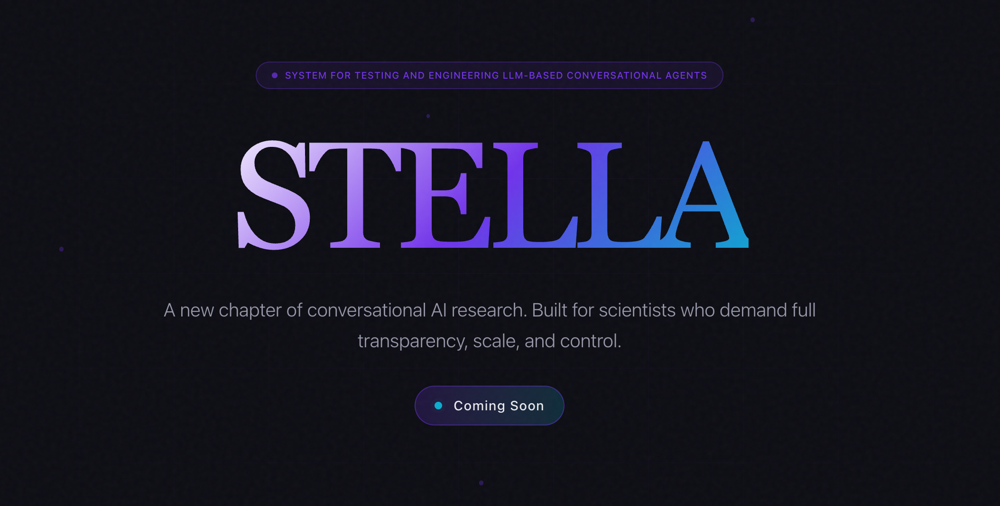

<p align="center">
  <picture>
    <source media="(prefers-color-scheme: dark)" srcset=".github/stella-banner.png">
    <source media="(prefers-color-scheme: light)" srcset=".github/stella-banner.png">
    
  </picture>
</p>

<h1 align="center">STELLA Backend</h1>

<p align="center">
  <strong>System for Testing and Engineering LLM-based Conversational Agents</strong>
</p>

<p align="center">
  A NestJS-based control plane for managing conversational AI sessions with LiveKit WebRTC integration and Kubernetes agent orchestration.
</p>

---

## Quick Start

**Get the entire system running in 3 commands:**

```bash
# 1. Create .env file with your credentials
cp .env.example .env
nano .env  # Set OPENAI_API_KEY and database credentials

# 2. Deploy everything
./scripts/start-k8s.sh

# OR: Run in background (survives SSH logout)
./scripts/start-k8s.sh --daemon
```

**Done!** System is now running at:
- **Frontend UI**: http://localhost:5173
- **API**: http://localhost:3000
- **LiveKit**: ws://localhost:7880
- **Agents**: Auto-created as Kubernetes pods

---

## Setting Up Your First Agent

### 1. Create an Environment Variable Template

Before deploying an agent, you need to create an environment variable template with your API keys:

1. Open the **Frontend UI** at http://localhost:5173
2. Go to **Settings** in the sidebar
3. Click **"New Template"** in the Environment Variables section
4. Add your API keys:
   - `OPENAI_API_KEY` - Your OpenAI API key (required)
   - `ELEVENLABS_API_KEY` - Optional, for ElevenLabs TTS
   - Any other environment variables your agent needs
5. Give the template a name (e.g., "Production Keys") and save

### 2. Deploy an Agent

1. Create or open a session from the Sessions page
2. Click **"Deploy Agent"** in the session view
3. Select your environment variable template from the dropdown
4. Choose an agent type:
   - **stella-agent** - Full-featured agent with advanced capabilities
   - **stella-light-agent** - Lightweight agent for simpler use cases
5. Optionally select a **Plan Template** to define the conversation flow
6. Click **Deploy**

The agent will start in a Kubernetes pod and automatically connect to the LiveKit room. You can then interact with it via voice or text.

### 3. Monitor Your Agent

- View agent status in the session panel
- Click on the agent to see logs and metrics
- Stop the agent when done to free up resources

---

## Deployment Modes

| Flag | Description | Use Case |
|------|-------------|----------|
| (default) | Foreground mode | Local development, press Ctrl+C to stop |
| `--daemon, -d` | Background mode | Remote servers, survives SSH logout |
| `--restart, -r` | Stop then restart | Apply code changes quickly |
| `--rebuild` | Force rebuild images | After Dockerfile changes |
| `--skip-build` | Skip builds | Restart pods only |
| `--stop` | Stop all services | Cleanup |
| `--dry-run` | Preview changes | Test before applying |
| `--production` | Production mode | Deploy with production settings |

**Examples:**
```bash
# Local development
./scripts/start-k8s.sh

# Production deployment in background
./scripts/start-k8s.sh --production --daemon

# Apply code changes (stop, rebuild, restart)
./scripts/start-k8s.sh --restart

# Force rebuild everything
./scripts/start-k8s.sh --rebuild

# Preview what would happen
./scripts/start-k8s.sh --dry-run --verbose
```

---

## Prerequisites

### LiveKit Server (Required)

STELLA requires an external LiveKit server for WebRTC communication. You need to set up LiveKit before deploying STELLA:

- **LiveKit Cloud** (recommended): [livekit.io/cloud](https://livekit.io/cloud) - Managed service, easiest setup
- **Self-hosted**: [LiveKit Server Documentation](https://docs.livekit.io/home/self-hosting/local/) - Run your own server

Once LiveKit is set up, configure the following in your `.env`:
```bash
LIVEKIT_URL=wss://your-livekit-server.com        # Internal URL for agents
PUBLIC_LIVEKIT_URL=wss://your-livekit-server.com # Public URL for browsers
LIVEKIT_API_KEY=your-api-key
LIVEKIT_API_SECRET=your-api-secret
```

### macOS (OrbStack or Docker Desktop)

- **Docker**: [Docker Desktop](https://docker.com/products/docker-desktop) or [OrbStack](https://orbstack.dev) (recommended)
- **kubectl**: Auto-installed if missing
- **OpenAI API key**

OrbStack provides a built-in Kubernetes cluster that's lightweight and fast. The startup script auto-detects OrbStack and uses it automatically.

### Linux (K3s)

- **Docker**: Docker Engine
- **K3s**: Auto-installed by the startup script
- **OpenAI API key**

K3s is a lightweight Kubernetes distribution that's automatically installed and configured by the startup script on Linux systems.

### Supported Platforms

- macOS (Intel & Apple Silicon)
- Ubuntu/Linux
- Windows (via WSL2)

---

## Architecture

```
                              ┌─────────────────────────┐
                              │   LiveKit Cloud/Server  │
                              │      (External)         │
                              │   WebRTC Media Server   │
                              └───────────┬─────────────┘
                                          │
                    ┌─────────────────────┼─────────────────────┐
                    │                     │                     │
                    ▼                     ▼                     ▼
┌─────────────────────────────────────────────────────────────────────────┐
│                         Kubernetes Cluster                              │
│  ┌───────────────────────────────────────────────────────────────────┐  │
│  │                       Namespace: ai-agents                        │  │
│  │                                                                   │  │
│  │  ┌──────────────┐  ┌──────────────┐  ┌──────────────────────────┐ │  │
│  │  │  PostgreSQL  │  │  Backend API │  │       Frontend UI        │ │  │
│  │  │    :5432     │  │    :3000     │  │         :5173            │ │  │
│  │  └──────────────┘  └──────────────┘  └──────────────────────────┘ │  │
│  │                                                                   │  │
│  │  ┌──────────────┐  ┌──────────────┐                               │  │
│  │  │ STT Service  │  │ TTS Service  │   Speech-to-Text & Text-to-  │  │
│  │  │   :50051     │  │   :50052     │   Speech microservices       │  │
│  │  └──────────────┘  └──────────────┘                               │  │
│  │                                                                   │  │
│  │  ┌──────────────────────────────────────────────────────────────┐ │  │
│  │  │              AI Agent Pods (Created On-Demand)               │ │  │
│  │  │  ┌───────────────┐  ┌───────────────┐  ┌───────────────┐     │ │  │
│  │  │  │ stella-agent  │  │ stella-agent  │  │  stella-light │ ... │ │  │
│  │  │  │   Session 1   │  │   Session 2   │  │    Session 3  │     │ │  │
│  │  │  └───────────────┘  └───────────────┘  └───────────────┘     │ │  │
│  │  └──────────────────────────────────────────────────────────────┘ │  │
│  └───────────────────────────────────────────────────────────────────┘  │
└─────────────────────────────────────────────────────────────────────────┘
          ↑                     ↑
    Port Forward          Port Forward
   localhost:5173       localhost:3000
```

**Key Components:**
- **LiveKit** - External WebRTC media server (cloud-hosted or self-hosted)
- **Backend API** - NestJS server managing sessions, agents, and LiveKit tokens
- **Frontend UI** - React app for real-time voice/text communication
- **STT/TTS Services** - Microservices for speech recognition and synthesis
- **Agent Pods** - Python conversational AI agents, created per session

---

## Features

### Project & Session Management
- Create and organize multiple projects
- Track sessions, agents, and activity per project
- Get aggregated statistics

### Agent Orchestration
- Deploy conversational AI agents to Kubernetes
- Automatic Secret and Pod creation
- Pass plan configurations via environment variables
- Monitor agent status and logs
- Graceful shutdown and cleanup

### LiveKit Integration
- JWT token generation for secure room access
- WebRTC-based real-time communication
- Data channel for text messages

### Data Persistence
- PostgreSQL database via Prisma ORM
- Track participants, messages, and room events
- Timeline view combining messages and events

---

## Useful Commands

```bash
# View all resources
kubectl get all -n ai-agents

# View agent pods
kubectl get pods -n ai-agents -l app=conversational-ai-agent

# View backend logs
kubectl logs -f -n ai-agents -l app=session-management-server

# Monitor daemon mode logs
tail -f /tmp/stella-ai-k8s/stella-ai-k8s.log

# Stop services
./scripts/start-k8s.sh --stop

# Restart with code changes
./scripts/start-k8s.sh --restart
```

---

## Troubleshooting

### Connection Issues

**"Connection to database failed"**
- Ensure PostgreSQL pod is running: `kubectl get pods -n ai-agents`
- Check DATABASE_URL in your `.env`
- Run migrations: `npx prisma migrate deploy`

**"Failed to create pod: Forbidden"**
- Check Kubernetes RBAC permissions
- Ensure namespace exists: `kubectl get namespace ai-agents`
- Verify ServiceAccount: `kubectl get sa -n ai-agents`

**"Agent pod not starting"**
- Check agent image exists: `docker images | grep stella`
- View pod logs: `kubectl logs <pod-name> -n ai-agents`
- Check pod events: `kubectl describe pod <pod-name> -n ai-agents`

**"LiveKit connection refused"**
- Ensure LiveKit pod is running
- Check port forwarding is active
- Verify LIVEKIT_URL in configuration

### Platform-Specific

**macOS (OrbStack)**
- Ensure OrbStack is running before starting the script
- OrbStack provides Kubernetes automatically, no additional setup needed
- If using Docker Desktop instead, ensure Kubernetes is enabled in settings

**Linux (K3s)**
- K3s is auto-installed by the startup script
- Ensure user has docker group permissions: `sudo usermod -aG docker $USER`
- After adding to docker group, log out and back in

### Daemon Mode Issues

```bash
# Check if port-forwards are running
cat /tmp/stella-ai-k8s/port-forwards.pid
ps -p $(cat /tmp/stella-ai-k8s/port-forwards.pid)

# View logs
tail -f /tmp/stella-ai-k8s/stella-ai-k8s.log

# Clean restart
./scripts/start-k8s.sh --stop
./scripts/start-k8s.sh --daemon
```

---

## API Reference

### Projects

```bash
# Create project
curl -X POST http://localhost:3000/projects \
  -H "Content-Type: application/json" \
  -d '{"name": "My Project"}'

# List projects
curl http://localhost:3000/projects

# Get project stats
curl http://localhost:3000/projects/:projectId/stats
```

### Sessions

```bash
# Create session
curl -X POST http://localhost:3000/projects/:projectId/sessions \
  -H "Content-Type: application/json" \
  -d '{"planId": "my_plan"}'

# Get join token
curl -X POST http://localhost:3000/sessions/:sessionId/joinToken \
  -H "Content-Type: application/json" \
  -d '{"identity": "user-123", "name": "John Doe"}'
```

### Agents

```bash
# Start agent
curl -X POST http://localhost:3000/sessions/:sessionId/agents \
  -H "Content-Type: application/json" \
  -d '{"role": "conversational-ai"}'

# Get agent status
curl http://localhost:3000/agents/:agentId

# Get agent logs
curl http://localhost:3000/agents/:agentId/logs

# Stop agent
curl -X DELETE http://localhost:3000/agents/:agentId
```

---

## Environment Variables

| Variable | Description | Default |
|----------|-------------|---------|
| `DATABASE_URL` | PostgreSQL connection string | Required |
| `PORT` | Server port | `3000` |
| `NODE_ENV` | Environment mode | `development` |
| `LIVEKIT_URL` | LiveKit server URL (internal) | Required |
| `PUBLIC_LIVEKIT_URL` | LiveKit URL for browser clients | Required |
| `LIVEKIT_API_KEY` | LiveKit API key | Required |
| `LIVEKIT_API_SECRET` | LiveKit API secret | Required |
| `KUBERNETES_NAMESPACE` | K8s namespace for agents | `ai-agents` |
| `AGENT_IMAGE` | Docker image for agents | `conversational-ai-server:latest` |
| `OPENAI_API_KEY` | OpenAI API key (for agents) | Required |
| `STT_PROVIDER` | Speech-to-text provider | `sherpa` |
| `TTS_PROVIDER` | Text-to-speech provider | `kokoro` |

---

## Development

### Local Development (Standalone)

```bash
# Install dependencies
npm install

# Generate Prisma client
npx prisma generate

# Run migrations
npx prisma migrate dev

# Start development server
npm run start:dev
```

### Running Tests

```bash
npm run test        # Unit tests
npm run test:e2e    # E2E tests
npm run test:cov    # Coverage
```

### Database Migrations

```bash
npx prisma migrate dev --name add_new_field  # Create migration
npx prisma migrate reset                      # Reset database
npx prisma migrate deploy                     # Deploy to production
```

---

## Documentation

- [Kubernetes Deployment Guide](./K8S_DEPLOYMENT.md)
- [Kubernetes Quick Start](../KUBERNETES_QUICK_START.md)

---

## License

This project is part of the STELLA workspace.
