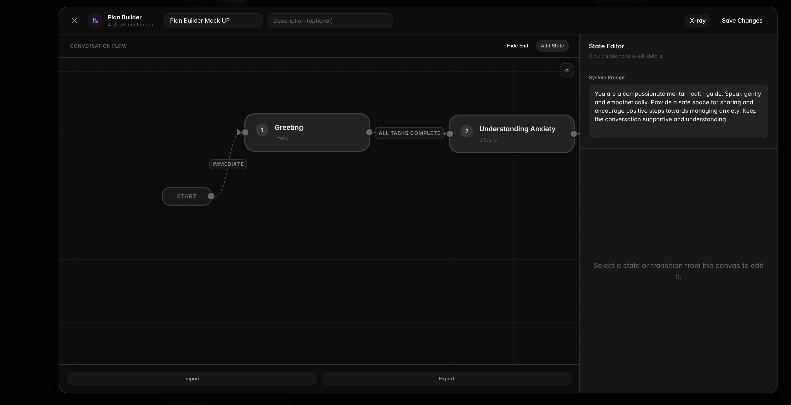
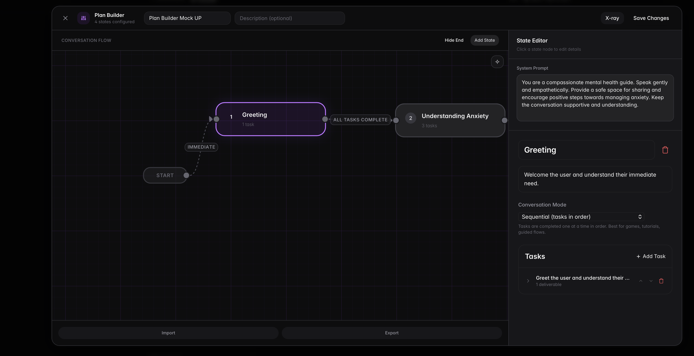
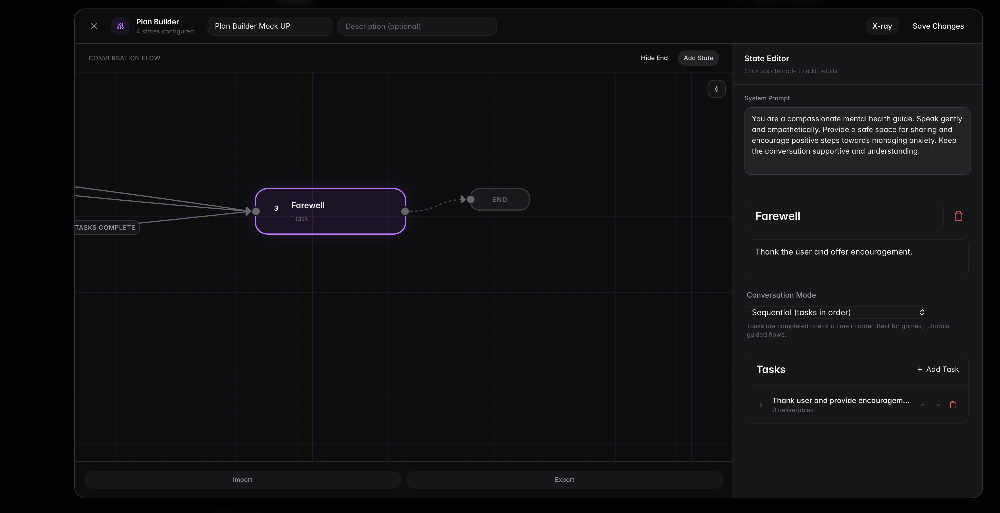
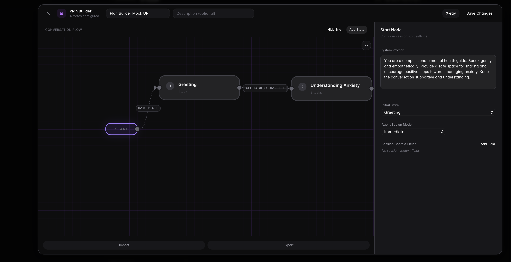
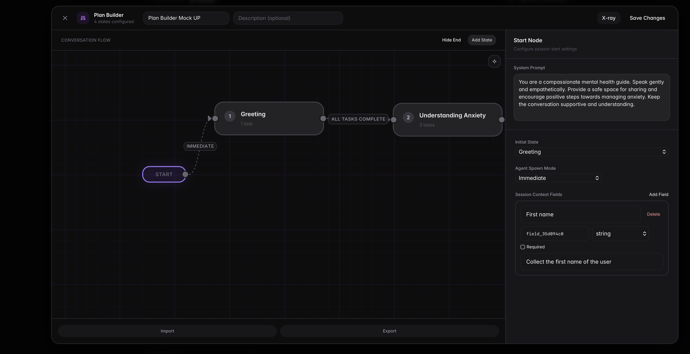
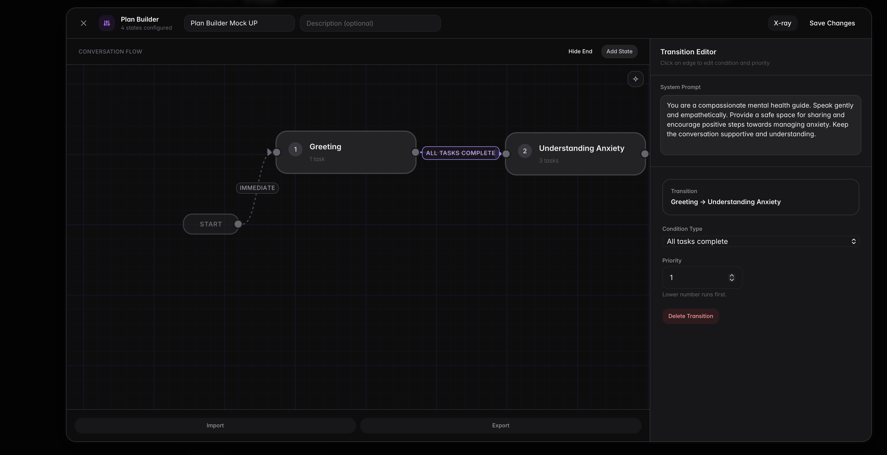
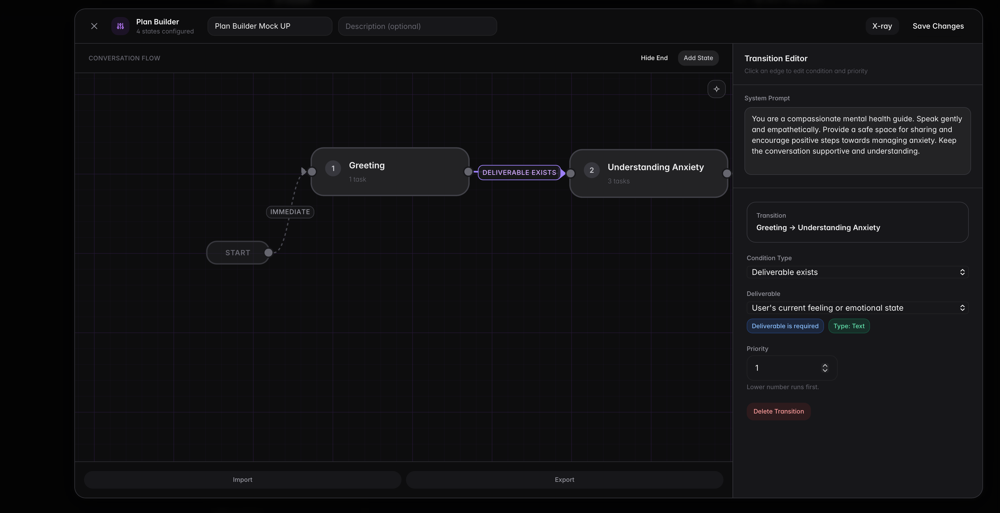
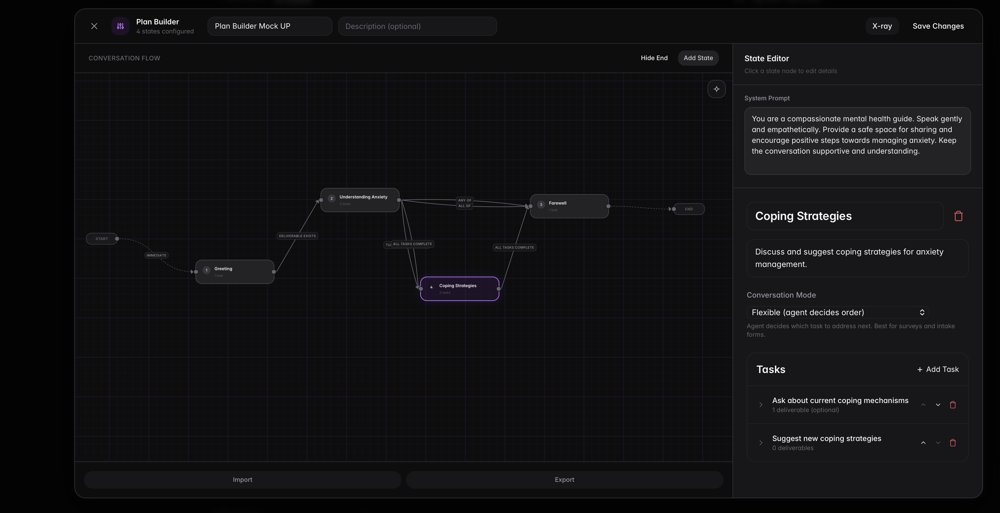

# Plan Builder

The Plan Builder is a visual canvas for designing conversation flow as connected states. It stores layout and connection metadata, but the saved plan remains standard plan JSON.

## Canvas Overview

The canvas uses a node-and-edge graph:

- **Nodes** represent conversation control points (`Start`, `State`, `End`)
- **Edges** represent transitions between states
- **Sidebar editors** configure the selected node or edge

Core interactions:

- Click a node to edit it
- Drag from one node handle to another to create an edge
- Click an edge label to edit condition and priority
- Drag nodes to save their canvas positions

The screenshot below shows the default visual layout: Start on the left, states in the middle, and End on the right. This is the mental model to keep while editing.



## Node Types

### Start Node

The Start node is fixed on the left side of the canvas and is always present.

It configures:

- `initial_state_id` (which state starts first)
- `agent_spawn_mode` (`immediate` or `on_demand`)
- `session_context.fields` (pre-session data collection fields)

### State Nodes

State nodes represent executable plan states.

Each state node can be connected to:

- Other state nodes (normal transitions)
- The End node (conversation termination path)

State node cards display:

- State order number (derived from graph order)
- State title
- Task count

When you click a state node, the right panel switches to the state editor. This is where you edit the state title, execution mode, tasks, and transitions.



### End Node

The End node is optional and can be toggled on or off in the builder.

When enabled, connecting a state to End adds that state ID to:

```json
{
  "metadata": {
    "plan_builder": {
      "canvas": {
        "end_state_ids": ["state_a", "state_b"]
      }
    }
  }
}
```

This screenshot shows a state connected to End. Use this to make terminal paths explicit in the visual plan.



## End Node Behavior

The End node is a visual way to mark terminal exits in your flow. It helps you and other developers see where a conversation is expected to finish.

When you connect a state to End in the canvas, the builder stores that relationship in:

- `metadata.plan_builder.canvas.end_state_ids`

The End node itself is UI metadata. Your runtime plan logic still comes from state transitions and terminal states.

### End Node Properties

| Property | Location in JSON | Description |
|----------|------------------|-------------|
| `show_end_node` | `metadata.plan_builder.canvas.show_end_node` | Whether the End node is visible in the canvas |
| `end_node_position` | `metadata.plan_builder.canvas.end_node_position` | End node coordinates on the canvas |
| `end_state_ids` | `metadata.plan_builder.canvas.end_state_ids` | IDs of states connected to End in the visual builder |

### End Node Example

```json
{
  "metadata": {
    "plan_builder": {
      "canvas": {
        "show_end_node": true,
        "end_node_position": { "x": 1240, "y": 240 },
        "end_state_ids": ["state_farewell", "state_handoff"]
      }
    }
  }
}
```

## Conversation Termination Flow

In practice, a conversation ends when execution reaches a terminal point in the plan. The End node helps visualize that intent, while the state machine and session lifecycle handle the shutdown.

Typical flow:

1. The user reaches a terminal state (for example, a farewell or handoff state).
2. Required tasks in that state are completed.
3. There is no further transition path to continue the plan.
4. The session moves through termination handling and closes.

### Practical Modeling Pattern

Use this pattern for predictable endings:

1. Route into a dedicated `farewell` state.
2. In that state, keep one clear closing task (thank the user, summarize, next step).
3. Do not add onward transitions from `farewell` unless you intentionally want the conversation to continue.
4. Optionally connect `farewell` to the End node in the canvas so the terminal path is explicit to readers.

### Validation Note

During save, the builder warns if a state has no outgoing transition and is not connected to End. This helps catch accidental dead-ends while still allowing intentional terminal states.

## Start Node Configuration

The Start node decides how a session begins. In practice, this is where you choose the entry point state, decide when the agent should spawn, and define what participant data should be collected before the conversation starts.

In this view, Start is selected and the right panel shows all session entry settings in one place.



### Start Properties

| Property | Location in JSON | Required | Description |
|----------|------------------|----------|-------------|
| `initial_state_id` | Root plan field | Yes | First state the agent enters |
| `agent_spawn_mode` | `metadata.plan_builder.start.agent_spawn_mode` | No | Agent startup behavior (`immediate` or `on_demand`) |
| `session_context.fields` | `session_context.fields` | No | Form fields shown before the session |

### `agent_spawn_mode` Options

| Mode | What it does | Typical use case |
|------|---------------|------------------|
| `immediate` | Agent starts as soon as the session starts | Standard guided interviews |
| `on_demand` | Agent starts when the conversation actually begins | Flows where users may wait before interacting |

### Start Node Example

```json
{
  "initial_state_id": "intro",
  "session_context": {
    "fields": [
      {
        "id": "participant_name",
        "label": "Your Name",
        "type": "string",
        "required": true
      }
    ]
  },
  "metadata": {
    "plan_builder": {
      "start": {
        "agent_spawn_mode": "immediate"
      }
    }
  }
}
```

## Session Context Fields

Session context fields are short questions asked before the plan starts. They are useful for collecting basics like name, language, role, or any information you want available from turn one.

This screenshot shows a populated session-context editor, including a `select` field with options.



### Field Properties

| Property | Type | Required | Description |
|----------|------|----------|-------------|
| `id` | `string` | Yes | Stable key used in plan/session data |
| `label` | `string` | Yes | User-facing field label |
| `type` | `string` | Yes | `string`, `number`, `boolean`, or `select` |
| `required` | `boolean` | Yes | Whether the user must fill this field |
| `description` | `string` | No | Helper text shown with the field |
| `options` | `string[]` | For `select` | Allowed options for dropdown fields |
| `default_value` | `string \| number \| boolean` | No | Optional default value in plan JSON |

### Field Types

| Type | Input behavior | Example |
|------|----------------|---------|
| `string` | Free text | Name, company, city |
| `number` | Numeric input | Years of experience, age |
| `boolean` | True/false toggle | Consent, prior participation |
| `select` | Dropdown | Preferred language, support tier |

### Session Context Example

```json
{
  "session_context": {
    "fields": [
      {
        "id": "participant_name",
        "label": "Your Name",
        "type": "string",
        "required": true,
        "description": "Please enter your full name"
      },
      {
        "id": "years_experience",
        "label": "Years of Experience",
        "type": "number",
        "required": false
      },
      {
        "id": "preferred_language",
        "label": "Preferred Language",
        "type": "select",
        "required": true,
        "options": ["English", "German", "French"],
        "default_value": "English"
      }
    ]
  }
}
```

## Edge Configuration

Selecting an edge opens transition configuration for the source → target pair.

For simple sequential flow, use `all_tasks_complete`. The screenshot below shows the edge editor with condition type and priority configured.



## Transition Properties

| Property | Type | Required | Description |
|----------|------|----------|-------------|
| `target_state_id` | `string` | Yes | State to transition to |
| `condition_type` | `string` | Yes | Condition evaluated each turn |
| `condition_config` | `object` | Depends | Parameters for conditional checks |
| `priority` | `number` | No | Lower number runs first |

## Condition Types in the Builder UI

The current visual editor supports:                                                                                           

- `all_tasks_complete`
- `deliverable_exists`
- `deliverable_value`

### `all_tasks_complete`

Transitions when required tasks in the current state are complete.

```json
{
  "target_state_id": "review",
  "condition_type": "all_tasks_complete",
  "priority": 1
}
```

### `deliverable_exists`

Transitions when a deliverable key is present.                              

```json
{
  "target_state_id": "needs_followup",
  "condition_type": "deliverable_exists",
  "priority": 1,
  "condition_config": {
    "key": "callback_requested"
  }
}
```

### `deliverable_value`

Transitions when a deliverable key matches an expected value.

```json
{
  "target_state_id": "premium_flow",
  "condition_type": "deliverable_value",
  "priority": 1,
  "condition_config": {
    "key": "membership_type",
    "value": "premium"
  }
}
```

When using deliverable-based routing, select the deliverable key first, then set the expected value. This screenshot shows a typical conditional edge setup.



## Priority and Route Selection

When multiple transitions are true, the transition with the lowest `priority` value wins.

Use explicit priority spacing for readability (for example `1`, `10`, `20`) to keep room for future routes.

This example canvas shows a branching flow with multiple outgoing transitions from one state. Use this pattern when the plan should route to different states based on user input.



## Builder Validation Rules

Before saving:

- Start must point to a valid state (`initial_state_id`)
- Transition conditions cannot be incomplete
- Duplicate outgoing conditions from the same source state are flagged as ambiguous

The builder also warns when states have no outgoing transitions and are not connected to End.

## JSON Mapping

The builder stores both execution data and canvas metadata.

Execution-level fields:

- `states`
- `initial_state_id`
- `session_context`
- `system_prompt`

Canvas metadata fields:

```json
{
  "metadata": {
    "plan_builder": {
      "start": {
        "agent_spawn_mode": "immediate"
      },
      "canvas": {
        "state_positions": {
          "state_1": { "x": 420, "y": 180 }
        },
        "show_end_node": true,
        "end_node_position": { "x": 1200, "y": 220 },
        "end_state_ids": ["state_3"]
      }
    }
  }
}
```

In short:

- Start behavior is stored in `metadata.plan_builder.start`
- Session context questions are stored in `session_context.fields`
- Canvas-only layout data stays in `metadata.plan_builder.canvas`

## Next Steps

- [States](/docs/plan-structure/states) — Configure state execution modes and transitions
- [Tasks](/docs/plan-structure/tasks) — Define task instructions and required work
- [Deliverables](/docs/plan-structure/deliverables) — Define what data each task must collect
